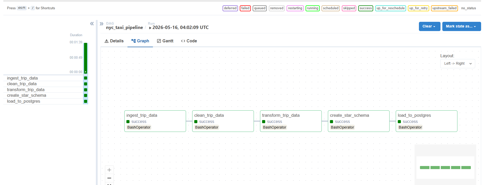
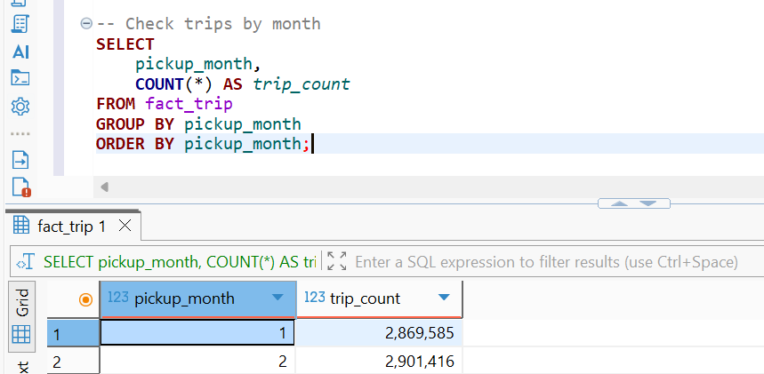
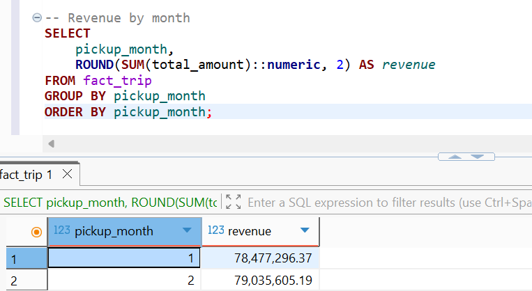

# 🚕 NYC Taxi Data Pipeline

ระบบ Data Pipeline สำหรับประมวลผลข้อมูลการเดินทางของ NYC Yellow Taxi แบบ End-to-End โดยใช้ **Apache Spark**, **Apache Airflow** และ **PostgreSQL** ในรูปแบบ Star Schema Data Warehouse เพื่อรองรับการวิเคราะห์ข้อมูลเชิงธุรกิจ

---

โปรเจกต์นี้ออกแบบและพัฒนา Data Pipeline แบบ ETL (Extract, Transform, Load) ตั้งแต่ขั้นตอนการดึงข้อมูล ทำความสะอาด แปลงข้อมูล สร้าง Star Schema และโหลดเข้าสู่ PostgreSQL Pipeline ทำงานอัตโนมัติผ่าน Apache Airflow และรองรับการประมวลผลข้อมูลหลายเดือนได้อย่างเป็นระบบ


---

## Dataset

ข้อมูลจาก [NYC TLC Trip Record Data](https://www.nyc.gov/site/tlc/about/tlc-trip-record-data.page) — **NYC Yellow Taxi Trip Records**

**ช่วงข้อมูลที่ใช้:** January–February 2024

**ข้อมูลในแต่ละ record ประกอบด้วย:**
- วันเวลาเริ่มและสิ้นสุดการเดินทาง
- ระยะทางและจำนวนผู้โดยสาร
- ค่าโดยสารและวิธีการชำระเงิน
- Vendor ของ Taxi
- จุดรับและส่งผู้โดยสาร (Location ID)

---

## Pipeline Architecture

```
NYC TLC API
    │
    ▼
[1. Ingest] ──► data/raw/{year}/{month}/
    │
    ▼
[2. Clean]  ──► data/processed/{year}/{month}/
    │
    ▼
[3. Transform] ──► data/curated/{year}/{month}/
    │
    ▼
[4. Star Schema] ──► data/warehouse/
    │                  ├── fact_trip/
    │                  ├── dim_date/
    │                  ├── dim_vendor/
    │                  ├── dim_payment/
    │                  └── dim_location/
    │
    ▼
[5. Load] ──► PostgreSQL (nyc_taxi_dw)
    │
    ▼
Analytics / SQL Query
```

---

## Tech Stack

| เครื่องมือ | บทบาท |
|---|---|
| Python | ภาษาหลักในการพัฒนา |
| PySpark | Distributed data processing |
| Apache Airflow | Workflow orchestration |
| PostgreSQL | Data Warehouse ปลายทาง |
| Docker | Containerization |
| DBeaver | Database management GUI |
| Parquet | รูปแบบไฟล์ระหว่าง stage (columnar format) |
| JDBC | เชื่อมต่อ Spark กับ PostgreSQL |
| GitHub | จัดเก็บ source code |

---

## 📁 Project Structure

```
nyc-taxi-pipeline/
│
├── dags/
│   ├── nyc_taxi_pipeline.py       # Airflow DAG หลัก
│   └── helpers/
│       ├── downloader.py          # ตัวช่วยดาวน์โหลดข้อมูล
│       └── validator.py           # ตรวจสอบคุณภาพข้อมูล
│
├── spark/
│   └── jobs/
│       ├── ingest_trip_data.py    # ดาวน์โหลดข้อมูลดิบ
│       ├── clean_trip_data.py     # ทำความสะอาดข้อมูล
│       ├── transform_trip_data.py # แปลงและเพิ่ม feature
│       ├── create_star_schema.py  # สร้าง Star Schema
│       └── load_to_postgres.py   # โหลดข้อมูลเข้า PostgreSQL
│
├── data/
│   ├── raw/                       # ข้อมูลดิบ (.parquet)
│   ├── processed/                 # ข้อมูลหลัง clean
│   ├── curated/                   # ข้อมูลหลัง transform
│   └── warehouse/                 # Star Schema tables
│
├── postgres_init/                 # SQL scripts สำหรับ init database
├── docker-compose.yml
├── Dockerfile
├── .env                           # Environment variables 
└── README.md
```

---

## 🔄 Pipeline Steps

### 1. Ingest (`ingest_trip_data.py`)

ดาวน์โหลดข้อมูล Yellow Taxi จาก NYC TLC รายเดือน บันทึกเป็น `.parquet` แบบ partition ตามปีและเดือน

**Output:** `data/raw/{year}/{month}/`

---

### 2. Clean (`clean_trip_data.py`)

ทำความสะอาดข้อมูลดิบ:

| เงื่อนไข | รายละเอียด |
|---|---|
| `fare_amount <= 0` | ลบออก |
| `trip_distance <= 0` | ลบออก |
| Timestamp เป็น NULL | ลบออก |
| Dropoff ก่อน Pickup | ลบออก |
| ข้อมูลผิดปีหรือเดือน | ลบออก (ป้องกัน dirty data ข้ามเดือน) |

นอกจากนี้ยังคำนวณ `trip_duration_minutes` เพิ่มในขั้นตอนนี้

**Output:** `data/processed/{year}/{month}/`

---

### 3. Transform (`transform_trip_data.py`)

เพิ่ม feature สำหรับการวิเคราะห์:

| Feature | คำอธิบาย |
|---|---|
| `pickup_year` | ปีที่รับผู้โดยสาร |
| `pickup_month` | เดือนที่รับผู้โดยสาร |
| `pickup_hour` | ชั่วโมงที่รับผู้โดยสาร |
| `pickup_weekday` | วันในสัปดาห์ (1 = อาทิตย์) |
| `revenue_per_mile` | รายได้ต่อไมล์ (`fare_amount / trip_distance`) |
| `avg_speed_mph` | ความเร็วเฉลี่ย (ไมล์/ชั่วโมง) |

**Output:** `data/curated/{year}/{month}/`

---

### 4. Create Star Schema (`create_star_schema.py`)

สร้าง Data Warehouse ในรูปแบบ Star Schema:

**Fact Table**

| ตาราง | คำอธิบาย |
|---|---|
| `fact_trip` | บันทึกทุก trip (partition by year/month) |

**Dimension Tables**

| ตาราง | คำอธิบาย |
|---|---|
| `dim_date` | ข้อมูลเวลา (ชั่วโมง, วัน, เดือน) |
| `dim_vendor` | ข้อมูล vendor (Creative Mobile Technologies, VeriFone Inc) |
| `dim_payment` | ประเภทการชำระเงิน |
| `dim_location` | จุดรับ-ส่งผู้โดยสาร |

**Output:** `data/warehouse/`

---

### 5. Load to PostgreSQL (`load_to_postgres.py`)

โหลด warehouse tables เข้า PostgreSQL database `nyc_taxi_dw` ผ่าน JDBC โดยอ่านข้อมูลแบบ `recursiveFileLookup` เพื่อรองรับหลายเดือนในครั้งเดียว

---

## 🔁 Airflow DAG



| Task | คำอธิบาย |
|---|---|
| `ingest_trip_data` | ดาวน์โหลดและจัดเก็บ raw data |
| `clean_trip_data` | ทำความสะอาดข้อมูล |
| `transform_trip_data` | แปลงข้อมูลและสร้าง features |
| `create_star_schema` | สร้าง fact และ dimension tables |
| `load_to_postgres` | โหลดข้อมูลเข้าสู่ PostgreSQL |

- **Schedule:** Manual trigger
- **Catchup:** ปิด
- รองรับการ rerun และประมวลผลหลายเดือนพร้อมกัน

---

## ผลลัพธ์ที่ได้

| เดือน | จำนวน Trip |
|---|---|
| January 2024 | 2,869,585 |
| February 2024 | 2,901,416 |
| **รวม** | **~5.77 ล้าน rows** |

---

## Data Quality Validation

การตรวจสอบคุณภาพข้อมูลทำผ่าน `dags/helpers/validator.py` โดยใช้ **PyArrow** อ่านไฟล์ Parquet โดยตรงก่อนเข้าสู่ขั้นตอน clean

| การตรวจสอบ | เงื่อนไข | พฤติกรรม |
|---|---|---|
| Schema | ต้องมีครบ 9 required columns | raise `ValueError` ถ้าขาด |
| Row count | ต้องมีมากกว่า 0 rows | raise `ValueError` ถ้าว่าง |
| Row count (min) | ควรมีมากกว่า 100,000 rows | log warning ถ้าน้อยกว่า |
| Null timestamp | `tpep_pickup_datetime` เป็น NULL ได้ไม่เกิน 1% | raise `ValueError` ถ้าเกิน |
| Negative fare | `fare_amount < 0` ได้ไม่เกิน 5% | raise `ValueError` ถ้าเกิน |
| Date range | ปีของข้อมูลต้องตรงกับ `year` ที่ระบุ | log warning ถ้าไม่ตรง |

**Required Columns:**

```python
REQUIRED_COLUMNS = {
    "tpep_pickup_datetime", "tpep_dropoff_datetime",
    "PULocationID", "DOLocationID",
    "trip_distance", "fare_amount",
    "total_amount", "passenger_count", "payment_type",
}
```

**รัน validator:**

```bash
python dags/helpers/validator.py
# ตรวจสอบ data/raw/2024/01/yellow_tripdata_2024-01.parquet
```

---

## 📈 ตัวอย่าง Analytics Queries

```sql
-- รายได้รวมต่อเดือน
SELECT
    pickup_month,
    ROUND(SUM(total_amount)::numeric, 2) AS revenue
FROM fact_trip
GROUP BY pickup_month
ORDER BY pickup_month;

-- จำนวนเที่ยวตาม Vendor
SELECT
    v.vendor_name,
    COUNT(*) AS trip_count
FROM fact_trip f
JOIN dim_vendor v ON f."VendorID" = v.vendor_id
GROUP BY v.vendor_name
ORDER BY trip_count DESC;

-- ชั่วโมงที่มีการเรียก Taxi สูงสุด
SELECT
    pickup_hour,
    COUNT(*) AS trip_count
FROM fact_trip
GROUP BY pickup_hour
ORDER BY trip_count DESC
LIMIT 5;

-- ค่าโดยสารเฉลี่ยแยกตามวันในสัปดาห์
SELECT
    pickup_weekday,
    ROUND(AVG(fare_amount)::numeric, 2) AS avg_fare
FROM fact_trip
GROUP BY pickup_weekday
ORDER BY pickup_weekday;
```
หลังจากกระบวนการ ETL เสร็จสิ้น ข้อมูลจะถูกจัดเก็บในรูปแบบ Star Schema บน PostgreSQL ซึ่งพร้อมสำหรับการทำ Business Intelligence (BI) นี่คือตัวอย่างผลลัพธ์การ Query ข้อมูลจริง:

### 1. ตรวจสอบจำนวนเที่ยวการเดินทาง (Total Trips) แบ่งตามเดือน
แสดงให้เห็นถึงการทำ Incremental Load ที่ข้อมูลของเดือนกุมภาพันธ์ถูกนำมาต่อท้ายเดือนมกราคมได้อย่างสมบูรณ์



### 2. สรุปยอดรายได้รวม (Total Revenue) แบ่งตามเดือน
ตัวอย่างการดึงข้อมูลรายได้รวมเพื่อนำไปวิเคราะห์แนวโน้มการเติบโตของธุรกิจ


---

## วิธีการใช้งาน

- Docker & Docker Compose
- Python 3.8+

### การตั้งค่าและรัน

```bash
# 1. Clone repository
git clone <repository-url>
cd nyc-taxi-pipeline

# 2. ตั้งค่า environment variables
cp .env.example .env
# แก้ไขค่าใน .env ตามความเหมาะสม

# 3. เริ่มต้น services
docker compose up -d

# 4. เปิด Airflow UI แล้ว Trigger DAG: nyc_taxi_pipeline
#    http://localhost:8080
```

### การเพิ่มเดือนที่ต้องการประมวลผล

แก้ไขตัวแปรใน `dags/nyc_taxi_pipeline.py`:

```python
YEAR = "2024"
MONTHS = ["01", "02", "03"]  # เพิ่มเดือนที่ต้องการ
```

### รัน job แยกทีละ step (สำหรับ debug)

```bash
cd /opt/airflow

python spark/jobs/ingest_trip_data.py 2024 01
python spark/jobs/clean_trip_data.py 2024 01
python spark/jobs/transform_trip_data.py 2024 01
python spark/jobs/create_star_schema.py 2024 01
python spark/jobs/load_to_postgres.py
```

---

## การเชื่อมต่อ PostgreSQL

ค่า config ถูกกำหนดผ่าน Environment Variables สร้างไฟล์ `.env` ที่ root ของโปรเจกต์:

```env
POSTGRES_HOST=postgres
POSTGRES_PORT=5432
POSTGRES_DB=nyc_taxi_dw
POSTGRES_USER=your_username
POSTGRES_PASSWORD=your_password
```

> **หมายเหตุ:** ใช้ `postgres` เป็น host ไม่ใช่ `localhost` เพราะรันใน Docker network

---

## ข้อควรระวัง

- **Dimension tables** ใช้ `mode=overwrite` ทุกครั้งที่รัน — ข้อมูลเก่าจะถูกแทนที่
- **Fact table** ปัจจุบันใช้ `mode=overwrite` เช่นกัน หากต้องการสะสมข้อมูลหลายรอบให้เปลี่ยนเป็น `append` พร้อมเพิ่ม deduplication logic
- PostgreSQL driver (`postgresql:42.7.3`) จะถูกดาวน์โหลดอัตโนมัติผ่าน `spark.jars.packages` ในขั้นตอน load

---
